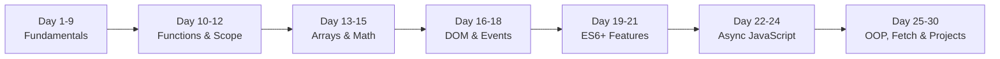

# JavaScript

30 days. 239 problems. Zero frameworks.

---

## Learning Path

---

## What I Learned

| Category | Skills |
|----------|--------|
| Fundamentals | Variables, Operators, Strings, Conditionals, Loops, Arrays, Objects |
| Functions | Arrow Functions, Default Params, Closures, Scope, Hoisting |
| Array Methods | map, filter, reduce, find, sort, some, every, forEach |
| DOM | getElementById, querySelector, Events, Propagation |
| ES6+ | Spread/Rest, Destructuring, Template Literals |
| Async | Callbacks, Promises, Async/Await, Promise.all |
| OOP | Classes, Inheritance, Getters/Setters, Private Fields |
| API | Fetch API, JSON, localStorage, HTTP Methods |

---

## Journey

| Day | Topic | Problems | File |
|-----|-------|----------|------|
| 01 | Variables & Data Types | 8 | `variables.js` |
| 02 | Operators | 8 | `operators.js` |
| 03 | Strings & Template Literals | 8 | `strings.js` |
| 04 | Conditionals (if/else) | 7 | `conditionals.js` |
| 05 | Switch & Ternary Operator | 7 | `switch_ternary.js` |
| 06 | Arrays | 8 | `arrays.js` |
| 07 | Objects | 8 | `objects.js` |
| 08 | For Loop | 9 | `forLoop.js` |
| 09 | While & Do-While Loops | 9 | `whileLoops.js` |
| 10 | Functions | 8 | `functions.js` |
| 11 | Arrow Functions & Default Parameters | 8 | `arrowFunctions.js` |
| 12 | Scope & Hoisting | 7 | `scope.js` |
| 13 | Array Methods (map, filter, reduce) | 8 | `arrayMethods.js` |
| 14 | More Array Methods (find, sort) | 8 | `arrayMethods2.js` |
| 15 | Date & Math Objects | 9 | `dateMath.js` |
| 16 | DOM Basics | 8 | `domBasics.js` |
| 17 | DOM Events | 8 | `domEvents.js` |
| 18 | Event Object & Propagation | 7 | `eventPropagation.js` |
| 19 | Spread & Rest Operators | 8 | `spreadRest.js` |
| 20 | Destructuring | 8 | `destructuring.js` |
| 21 | Closures | 7 | `closures.js` |
| 22 | Callbacks & Higher Order Functions | 7 | `callbacks.js` |
| 23 | Promises | 8 | `promises.js` |
| 24 | Async/Await | 8 | `asyncAwait.js` |
| 25 | Error Handling | 8 | `errorHandling.js` |
| 26 | Classes & OOP | 8 | `classes.js` |
| 27 | JSON & Local Storage | 8 | `jsonStorage.js` |
| 28 | Fetch API & HTTP Requests | 8 | `fetchApi.js` |
| 29 | ES6 Modules | 7 | `math.mjs` |
| 30 | Mini Project: Todo App | 10 | `miniProject.js` |

---

